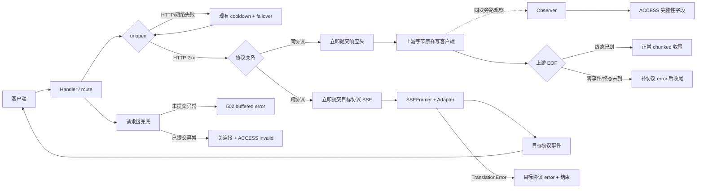

# 背景与问题

现有首帧预读为低频坏流引入 buffer、continuation、流级 failover 和多层异常契约，并曾制造 125 次 30 秒误杀。本方案按已确认的 **B+ 档**：同协议恢复即时字节透传，解析仅作旁路观察；只在上游已 EOF、确定不可能再有正常内容时补发协议 error，兼顾简单性与 SDK 可感知性。

本版替代 [[tools/model_proxy/docs/designs/2026-08-23-最小可靠透传重构方案]]。旧版不补 EOF error；本版改为 EOF 善后报错。

## 目标

1. PASSTHROUGH 正常流量与上游字节、时序一致，不等待首事件。
2. 只有 HTTP 建连/状态码失败可换 supply；HTTP 200 后不换 supply。
3. 活流转发过程中，旁路解析失败绝不影响客户端收流。
4. 上游正常 EOF 时，若终态缺失，补发客户端协议 error 后结束 chunked，使 SDK 明确报错。
5. 跨协议保留严格转换与 P0 终态校验，但删除首帧 probe/failover 子系统。
6. 任意未受控异常都有请求级结果：未提交返回 502；已提交关闭连接并完整落账。
7. 不新增 `ProxyError` 层级，只保留 `TranslationError` 作为协议转换错误。

## 非目标

- 不救回 HTTP 200 后的坏请求，不拼接第二个 supply。
- 不在活流期间拦截、改写、等待或中断上游内容。
- 不立即修复审计中的 11 项理论风险；先观察，出现活体再立项。
- 不改变 count_tokens、HTTP 429/5xx/网络 failover、路由与预算逻辑。
- 不改三协议映射规格与既有 P0 终态语义。

# 方案设计

## 1. 拆后架构



唯一控制边界：

- **HTTP 2xx 前**：允许现有 HTTP/网络 failover。
- **活流期**：同协议只透传，observer 无控制权；跨协议只做必需转换。
- **正常 EOF**：流已死亡，observer 只决定“直接结束”或“补 error 后结束”；两者都不换 supply。

### B+ 与 C 档的严格区别

| 维度 | C 档 | B+ 档 |
|---|---|---|
| 判断时点 | 首帧及活流过程中 | 仅上游正常 EOF 后 |
| 是否延迟首字节 | 是 | 否 |
| 是否缓存 prefix | 是 | 否 |
| 是否流级 failover | 是 | 否 |
| 是否中途拦截 | 是 | 否 |
| 处理结果 | 可换 supply、改当前请求路径 | 只能补 error 并结束已死亡流 |

EOF 善后不是活流干预：EOF 后不可能再出现正常内容；补 error 不覆盖、不丢弃、不延迟任何上游字节，只把原本静默断尾变为 SDK 可解析失败。

## 2. 同协议 PASSTHROUGH 主链

`/Users/vincentwang/Documents/NoteVault/tools/model_proxy/core/server.py::_forward()` 在 `is_stream and mode == PASSTHROUGH` 时不再 probe：

1. `urlopen()` 成功并取得 HTTP 2xx。
2. 立即调用简化后的 `_write_streaming_response()` 提交上游响应头。
3. 循环 `resp.read()`；每块先原样写客户端，再把同一 `bytes` 引用交给 observer。
4. 读到正常 EOF，调用 `observer.finish()`：
   - `terminal`：正常写 chunked 终止符。
   - `no_business_event`：补 `empty_stream` error，再写终止符。
   - `missing_terminal`：保留已发前缀，补 `unexpected_eof` error，再写终止符。
   - `observer_error`：不把观察器自身故障伪装成上游断尾；只记日志，直接结束 chunked。
5. 上游 read 抛异常不是正常 EOF：不补造 SSE error、不换 supply；记 `invalid/upstream_read_error` 后关闭连接。
6. 客户端写异常：记 `client_disconnect`，关闭上游。

字节不缓存、不重排、不重序列化。唯一新增字节是正常 EOF 且确定缺少终态时的协议 error。

### EOF 善后写失败

`stream_error_event_for_source()` 与 chunked 终止符的写入处于现有客户端写异常边界内：

- `BrokenPipeError/ConnectionResetError/OSError` → 只记 `client_disconnect`，不二次抛出。
- 不重试写、不进入请求级 502、不改变 supply 健康状态。
- `finally` 始终关闭上游 response。

## 3. 旁路观察器

### 3.1 实现选择

采用 `PassthroughStreamObserver` 组合现有 `SSEFramer + PassthroughTerminalTracker`，不另写关键词扫描器。

```text
feed(chunk: bytes, elapsed_ms: int) -> None
finish() -> ObservationResult
```

`ObservationResult` 至少包含：

```text
kind = terminal | no_business_event | missing_terminal | observer_error
terminal_state: TerminalState | None
reason: str
first_event_ms: int | None
```

规则：

- `feed()`/`finish()` 全路径捕获 `Exception`，记录 `observer_error` 并停止解析，绝不向 writer 抛。
- 首个完整非注释业务事件记录 `first_event_ms`；不控制提交。
- 终态已到：`terminal`。
- 零业务事件 EOF：`no_business_event/empty_stream`。
- 有业务事件但终态未到：`missing_terminal/unexpected_eof`。
- JSON/嵌套形状等 observer 自身解析失败：`observer_error`；继续透传，EOF 不补错误，避免以不可信观察结果改写响应。

复用理由：`SSEFramer` 已支持 LF/CRLF、跨 chunk、多行 data；tracker 已有三协议终态映射。新轻量扫描器会形成第二套不可信协议判断。

### 3.2 控制权限制

Observer 唯一允许影响 writer 的出口是：

```text
正常 EOF && result.kind in {no_business_event, missing_terminal}
```

其余时点和结果均不得：

- 阻止已有/后续 chunk 转发；
- 触发 failover/cooldown；
- 生成 error；
- 关闭活跃上游；
- 抛异常到 writer。

## 4. 坏供应方后续处置（已定）

采用软阈值方案，但首版只观测一周，不执行冷却：

- 统计规则预定为：同一 supply 10 分钟内连续 3 次 `invalid`，冷却 60 秒；任一 `valid` 清零。
- `client_disconnect/observer_error` 不计。
- 首版 `enforcement=false`：记录连续次数并在 status 暴露，不调用 cooldown。
- 一周后基于真实分布单独确认是否打开；不得在本次实施中自动启用。
- 若后续启用，使用独立 `StreamHealthStore`；达到阈值后调用现有 `CooldownStore.cooldown()`，不得缩短已有 429/5xx cooldown。
- 状态仅进程内保存，重启清零，不落盘。

EOF `empty_stream/unexpected_eof` 均计 `invalid`；善后 error 写失败后结果改为 `client_disconnect`，不计 supply invalid。

## 5. 跨协议流

跨协议保留：

- `SSEFramer`
- 三个 adapter
- `TranslationError`
- P0 终态校验
- 转换失败后的目标协议 error

删除通用首帧 probe：

1. `urlopen()` 取得 HTTP 2xx 后立即提交目标协议 SSE。
2. 逐事件解析、转换、写出。
3. 首事件 malformed/error 不 failover；在已提交流内生成目标协议 error 并结束。
4. EOF 无合法终态仍由 adapter `finalize()` 生成失败，不伪造成功。
5. adapter 非 `TranslationError` 异常在跨协议 writer 边界统一包装为 `TranslationError(reason="internal_translation_error")`；不建立新错误层级。

跨协议解析是转换必需；提交前预读和流级 failover不是。若跨协议继续 probe，大部分复杂子系统无法删除，与 B+ 目标冲突。

## 6. 请求级兜底

在 `/Users/vincentwang/Documents/NoteVault/tools/model_proxy/core/server.py::_forward_logged()` 建立唯一兜底：

```text
try:
    _forward()
except client_disconnect:
    标记 client_disconnect
except Exception:
    if response_committed == 0:
        尝试发送 source 协议 502 buffered error
    else:
        关闭连接，不再写协议事件
    记录 internal_escape + exception class
finally:
    committed 流若 integrity 仍为空：强制 invalid/internal_escape
    输出 ACCESS 与账本
```

约束：

- 业务分支仍就地处理预期异常；该层只防 Python 异常裸奔。
- 不捕 `BaseException`。
- 兜底写响应失败只记 client_disconnect，不能二次抛出。
- EOF 善后属于 PASSTHROUGH writer 正常分支，不由请求级兜底生成。
- 跨协议预期 `TranslationError` 仍由 writer 生成目标协议 error，请求级兜底不重复补错。

## 7. ACCESS 字段语义

保留现有字段：

| 字段 | B+ 语义 |
|---|---|
| `response_committed` | 是否已提交 HTTP 响应头；同协议进入 writer 即为 1 |
| `stream_integrity` | `valid/invalid/client_disconnect/observer_error`；非流请求留空 |
| `terminal_status/reason` | observer 或 adapter 的终态；空流/断尾为 `open + empty_stream/unexpected_eof` |
| `first_event_ms` | `urlopen()` 返回至 observer 看到首个完整业务事件；只观测，不控制提交 |
| `final_error` | 最终客户端可见失败或内部逃逸；EOF 善后写 `empty_stream/unexpected_eof` |

正常 EOF 缺终态：

```text
response_committed=1 stream_integrity=invalid terminal_status=open
terminal_reason=empty_stream|unexpected_eof final_error=<同 reason>
```

Observer 自身失败：

```text
response_committed=1 stream_integrity=observer_error terminal_status=open
terminal_reason=observer_error
```

finally 不变量：

```text
response_committed=1 AND is_stream=true
=> stream_integrity 必须非空
```

账本：`valid` 才计协议完成；`invalid` 计失败；`client_disconnect`、`observer_error` 单列，不归因上游业务失败。

## 8. 删除 / 保留 / 新增

### 8.1 删除

`/Users/vincentwang/Documents/NoteVault/tools/model_proxy/core/server.py`

- `StreamProbeResult`
- `_STREAM_PROBE_MAX_BYTES`
- `_set_upstream_read_timeout()`
- `_probe_upstream_stream()`
- `_probe_consume_event()`
- `_commit_and_write_probed_stream()`
- 仅为 probe 服务的 adapter helper
- `stream_failed_supply_ids`
- `last_retryable_error` 的 stream 分支、`saw_stream_timeout`
- probe 失败流级 failover、跨 route 排除、502/504 exhaustion 逻辑
- `a3a162c` 首帧 timeout 切换逻辑
- 不可达 `_sniff_passthrough_usage()`
- 三条旧/new转换 writer 的重复实现；最终每方向只留一条

测试删除：

- 30/1800 秒首事件 deadline
- probe 总 buffer 预算
- probe failover、跨 route bad-supply 排除
- continuation 单次消费
- `stream_integrity_exhaustion_is_502`

### 8.2 保留

- `SSEFramer`
- `PassthroughTerminalTracker`，仅供 observer
- 三个转换 adapter 与 `TranslationError`
- 非流转换终态校验
- HTTP 429/5xx/URLError cooldown+failover
- count_tokens 独立链路及测试
- ACCESS、账本、active sessions、stream integrity 展示
- `stream_error_event_for_source()`：跨协议错误与 PASSTHROUGH EOF 善后共用

### 8.3 新增

- `PassthroughStreamObserver`、不可变 `ObservationResult`
- PASSTHROUGH EOF 善后分支
- 请求级异常兜底与 finally integrity 收口
- `StreamHealthStore` 观测计数，首版 enforcement 固定关闭
- PASSTHROUGH 即时字节测试
- observer 隔离测试
- 空流/断尾/善后写失败测试
- `_forward()` handler 级四路流回归

## 9. 文件级改造

### `/Users/vincentwang/Documents/NoteVault/tools/model_proxy/core/translate.py`

- 新增 observer 与 result。
- 保留 framer/tracker；所有异常止于 observer。
- tracker 只做最低限度形状防御，不建立错误类型层级。
- 三 adapter 映射不变。

### `/Users/vincentwang/Documents/NoteVault/tools/model_proxy/core/server.py`

- 删除 probe 与流级 failover。
- PASSTHROUGH 改为 write-first、observe-second、EOF 按 result 善后。
- 跨协议恢复边读边转换，不预读。
- `_forward_logged()` 增加唯一兜底和 finally 不变量。
- server 持有只观测的 `StreamHealthStore`。

### `/Users/vincentwang/Documents/NoteVault/tools/model_proxy/_format_ops.py`

- 区分 `invalid/client_disconnect/observer_error`。
- status 展示连续 invalid 计数；明确 `enforcement=false`。

### 测试

- `tests/test_passthrough_sniff.py`：改为 observer 与 EOF 善后测试，删除旧 sniff 直驱。
- `tests/test_protocol_terminal_handler.py`：删除 probe 契约，保留转换 P0，新增 handler 主链。
- `tests/test_cooldown_rules.py`：只保留 HTTP failover；新增软阈值“统计但不执行”断言。
- `tests/test_usage_totals.py`、`test_format_ops.py`：补 observer_error、EOF invalid 与 finally 收口。
- `test_budget_retry.py`、`test_count_tokens.py`：只回归，语义不变。

### 文档

- `README.md`、`CHANGELOG.md`：说明只有 HTTP 级 failover；HTTP 200 后不换 supply；正常 EOF 缺终态会补协议 error；`first_event_ms` 为旁路指标。

## 10. 实施分批（已定）

采用**两步开发、一个版本发布、一次重启**：

1. **行为切换**：PASSTHROUGH/跨协议拆 probe；接入 observer；实现 B+ EOF 善后、请求兜底、finally 收口和只观测健康计数。旧 probe 暂留但零调用。
2. **机械清理**：确认调用图后删除 probe、重复 writer、旧测试，更新文档。
3. 两步分别跑全量测试并独立 review；合并后只发布、重启一次，不向生产暴露中间态。

# 风险与权衡

1. EOF 善后只能让 SDK 明确失败，不能救回本次请求。
2. `observer_error` 时不补 EOF error，避免观察器自身 bug 伪造上游错误；finally 保证不静默落账。
3. read 抛异常不是正常 EOF，本期不补协议 error；客户端表现为连接异常，ACCESS 可定位。若出现真实需求再评估。观察期需注意：即使此前已观察到合法终态，随后发生 RST 仍按 `invalid/upstream_read_error` 记录并计入健康观察。
4. 旁路宽捕是刻意隔离，只允许存在于 observer；跨协议转换仍 fail-fast。
5. 跨协议首事件坏流不再 failover，可靠性低于 C 档；这是删除 probe 的必要边界。
6. 软阈值首版不执行，避免基于 0.62% 低频样本误伤健康 supply。
7. 实施必须重启代理；热 reload 无效。

## 迁移/落地代价

这是删除式重构，代码净量应显著下降，但流主链耦合高。实施后独立复核四点：生产调用图无 probe、活流期 observer 无控制边、EOF 善后仅缺终态触发、HTTP failover与跨协议 P0 均未退化。

# 验证方式

## 1. PASSTHROUGH 正常与隔离

1. 正常、坏 JSON、未知事件、嵌套错误类型：活流期间客户端收到上游字节逐字节一致。
2. 上游每产一块立即写一块，不等待完整 SSE 首事件。
3. observer.feed 注入任意 Exception，writer 继续至 EOF；最终记 observer_error，不补伪错误。
4. HTTP 200 后任何流异常均不换 supply。

## 2. B+ EOF 善后

1. **空流**：零业务事件 EOF → 输出对应协议 error + chunked 终止符；Anthropic/Responses SDK 均能解析为失败；ACCESS `invalid/empty_stream`。
2. **断尾**：先发送合法前缀但无终态 → 前缀逐字节保留，随后补对应协议 error + 终止符；ACCESS `invalid/unexpected_eof`。
3. **正常流**：终态到达后 EOF → 不增删任何 SSE 事件，正常收尾。
4. **善后时客户端已断**：error 或终止符写入抛 BrokenPipe/Reset/OSError → 不再抛，只记 client_disconnect、关闭上游。
5. **observer 自身失败**：EOF 不补 error，只记 observer_error。

## 3. failover 与健康观察

1. HTTP 429/500/502/URLError 仍按现有配置 cooldown+failover。
2. 200 空流/断尾补错但不换 supply。
3. 连续 3 次 invalid 只增加观测计数，不触发 cooldown；status 显示 enforcement=false。
4. valid 清零连续计数；client_disconnect/observer_error 不计。

## 4. 跨协议

1. 三方向正常流事件序列与改前一致。
2. malformed 首事件不换 supply，目标协议收到 error 后结束。
3. EOF 无终态仍由 adapter P0 生成 failed。
4. adapter 非受控异常包装为 internal_translation_error，无 handler traceback。

## 5. 请求兜底与观测

1. `_forward()` 提交前异常：source 协议 502，committed=0。
2. 提交后异常：不二次写 header、不换 supply、integrity 非空。
3. 所有 committed 流的 ACCESS integrity 非空。
4. first_event_ms 不影响首字节时延。
5. 账本中 observer_error 不计 ok、不计 upstream invalid。

## 6. 回归命令

```bash
cd /Users/vincentwang/Documents/NoteVault/tools/model_proxy
python3 -m pytest -q
# 基线：756 passed

git grep -n '_probe_upstream_stream\|StreamProbeResult\|_STREAM_PROBE_MAX_BYTES'
# 第二步完成后生产代码无命中
```

真实流量：

1. anthropic→anthropic 的 opus/sonnet 正常长流，首字节无 probe 等待。
2. mock 200 空流、200 断尾，确认 SDK 明确报错且无 failover。
3. mock 429→200，确认 HTTP failover 恢复。
4. 跨协议三方向各一条正常流、一条 malformed 流。
5. 重启后观察 24 小时：committed=1 且 integrity 为空必须为 0；固定 30 秒型 504 必须为 0。

# 关联

- 替代：[[tools/model_proxy/docs/designs/2026-08-23-最小可靠透传重构方案]]
- [[tools/model_proxy/docs/designs/2026-08-23-异常逃逸与全局潜在风险全面审计]]
- [[tools/model_proxy/docs/designs/2026-08-23-passthrough终态与首帧预读failover-v2]]
- [[tools/model_proxy/docs/designs/2026-08-22-跨协议静默丢弃审计与修复方案-v4]]
