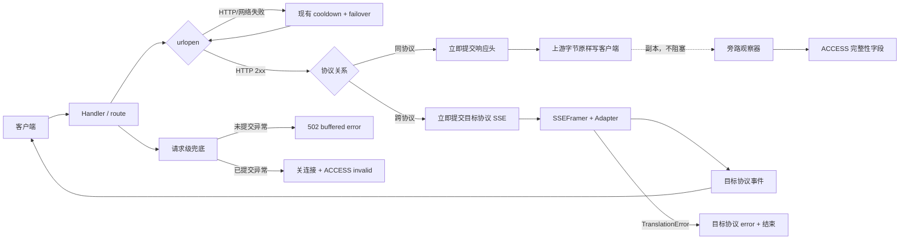

# 背景与问题

现有统一首帧预读为低频坏流引入了 buffer、continuation、流级 failover 和多层异常契约，并曾制造 125 次 30 秒误杀；本方案按已确认的 B 档，将同协议链路恢复为纯字节透传，把解析降为永不干预主链的旁路观测，同时保留跨协议转换与 HTTP 级容灾。

## 目标

1. PASSTHROUGH 正常流量与上游字节、时序一致，不等待首事件。
2. 只有 HTTP 建连/状态码失败可换 supply；HTTP 200 后任何路径均不换 supply。
3. 同协议旁路解析失败绝不影响客户端收流。
4. 跨协议继续严格转换与终态校验，但不再为首帧单设 probe/failover 子系统。
5. 任意未受控异常都有请求级结果：未提交返回 502；已提交关闭连接并完整落账。
6. 不新增 `ProxyError` 层级，只保留 `TranslationError` 作为协议转换错误。

## 非目标

- 不立即修复审计中的 11 项理论风险；先加观测，出现活体再立项。
- 不保证救回 HTTP 200 后的空流、坏流、断尾请求。
- 不改变 count_tokens、HTTP 429/5xx/网络 failover、路由与预算逻辑。
- 不改三协议映射规格与既有 P0 终态语义。

# 方案设计

## 1. 拆后架构



关键边界只有两个：

- **HTTP 2xx 提交前**：允许现有 HTTP/网络 failover。
- **提交后**：禁止切 supply。同协议只转发；跨协议只能转换、补目标协议错误或关连接。

## 2. 同协议 PASSTHROUGH

### 2.1 主链

`/Users/vincentwang/Documents/NoteVault/tools/model_proxy/core/server.py::_forward()` 在 `is_stream and mode == PASSTHROUGH` 时不再调用 probe：

1. `urlopen()` 成功并取得 HTTP 2xx。
2. 立即调用简化后的 `_write_streaming_response()` 提交上游响应头。
3. 循环 `resp.read()`；每块先原样写给客户端，再把同一 `bytes` 引用交给观察器。
4. 上游 EOF 后结束 chunked；观察器收口仅更新 `_acc`。
5. 上游 read 异常：不补造 SSE error，不换 supply；记 `invalid/upstream_read_error` 后关闭。
6. 客户端写异常：记 `client_disconnect`，关闭上游。

字节不缓存、不重排、不重序列化。观察器异常被吞并为观测失败，不能阻止后续 read/write。

### 2.2 旁路观察器实现取舍

#### 方案 A：复用 `SSEFramer + PassthroughTerminalTracker`，外包纯观察壳（推荐）

新增轻量 `PassthroughStreamObserver`，内部组合现有两者：

```text
feed(chunk, now) -> None
finish(eof_kind) -> ObservationResult
```

- `feed()`/`finish()` 全路径 `except Exception`，转换为 `observer_error` 状态并停止继续解析；绝不向 writer 抛。
- 首个完整非注释业务事件时记录 `first_event_ms`。
- 正常 EOF 时调用 tracker.finalize，得到 valid/invalid。
- read error 时：已有确认终态则 valid，否则 invalid/upstream_read_error。
- 观察器坏掉后 writer 继续纯透传；finally 用 `observer_error` 收口，不能留空。

优点：复用已覆盖 LF/CRLF、多行 data、终态映射；删除主链控制权即可。缺点：tracker 当前嵌套类型防御不足，仍需在观察壳中宽捕；其严格语义可能比观测所需更重。

#### 方案 B：新写轻量字符串扫描器

只扫描 `message_stop/response.completed` 等关键词，不完整解析 JSON。

优点：代码短、不会因嵌套类型崩。缺点：可能命中正文字符串、无法可靠区分 error/终态/usage，观测数据不可信，最终仍会演化成 SSE parser。

**结论**：选 A。保留一个可信 parser，比新增第二套弱 parser 更简单。`PassthroughTerminalTracker` 改名与否不影响本期；建议保留原名，避免无收益重命名。

## 3. 坏供应方对后续请求的影响（待拍板）

断尾活体约占新 schema 0.62%，且部分只能确认“完整性为空”，不能全部归因上游。三种方案：

| 方案 | 规则 | 优点 | 风险 |
|---|---|---|---|
| A. 只观测 | 不影响选路 | 最简单，零误伤 | 持续坏 supply 不会自动规避 |
| B. 软阈值冷却 | 同一 supply 10 分钟内连续 3 次 `invalid`，冷却 60 秒；任一 valid 清零 | 过滤持续故障，偶发一次不惩罚 | 新增小型内存状态机 |
| C. 立即冷却 | 每次 invalid 立即冷却 60 秒 | 恢复快 | 0.62% 偶发坏流可能误伤整体健康 supply |

**推荐 B**，但分两阶段启用：首版先实现计数和 status 暴露，`enforcement=false`；观察一周确认归因后再开。若用户要求本次即影响后续请求，则直接启用 B。

实现边界：

- 新增独立 `StreamHealthStore`，不把连续计数塞进 `CooldownStore`。
- 达阈值后调用现有 `CooldownStore.cooldown(supply_id, 60, "stream_integrity")`。
- cooldown 截止时间取现有与新值的较大者，不缩短 429/5xx 冷却。
- 只计 `invalid`；`client_disconnect`、`observer_error` 不计。
- 进程内状态，重启清零，不落盘。

## 4. 跨协议流

跨协议不能纯透传，保留：

- `SSEFramer`
- 三个 adapter
- `TranslationError`
- P0 终态校验
- 转换失败后的目标协议 error

但删除通用首帧 probe：

1. `urlopen()` 取得 HTTP 2xx 后立即提交目标协议 SSE 响应。
2. 逐事件解析、转换、写出。
3. 首事件 malformed/error 不再 failover；在已提交流内生成目标协议 error 并结束。
4. EOF 无合法终态仍由 adapter `finalize()` 生成失败，不伪造成功。
5. adapter 非 `TranslationError` 异常在跨协议 writer 边界统一包装成 `TranslationError(reason="internal_translation_error")`，记录原异常类；不建立新错误层级。

理由：如果同协议只做 HTTP 级 failover，而跨协议仍保留 stream probe，会继续保留 `StreamProbeResult`、buffer、deadline、attempt-local continuation 等大部分复杂度，达不到 B 档目标。跨协议的解析是转换必需，**预读与流级 failover不是**。

## 5. 请求级兜底

在 `/Users/vincentwang/Documents/NoteVault/tools/model_proxy/core/server.py::_forward_logged()` 建立唯一兜底：

```text
try:
    _forward()
except client_disconnect:
    标记 client_disconnect
except Exception:
    if response_committed == 0:
        尝试发送 source 协议 502 buffered error
    else:
        关闭连接，不再写协议事件
    记录 internal_escape + exception class
finally:
    committed 流若 integrity 仍为空：强制 invalid/internal_escape
    输出 ACCESS 与账本
```

约束：

- 业务分支仍应把预期异常就地转换；该层只防 Python 异常裸奔。
- 不能捕 `BaseException`。
- 兜底写响应本身失败只记 client_disconnect，不能二次抛出。
- 已提交跨协议的预期 `TranslationError` 仍由 writer 生成目标协议 error；请求级兜底不重复补错。

## 6. ACCESS 字段语义

保留全部现有字段，避免日志/formatter/账本再次迁移：

| 字段 | 拆后语义 |
|---|---|
| `response_committed` | 是否已向客户端提交 HTTP 响应头；同协议进入 writer 即为 1 |
| `stream_integrity` | `valid/invalid/client_disconnect/observer_error`；生成类非流请求留空 |
| `terminal_status/reason` | 旁路观察或 adapter 得出的终态；观察器自身坏掉时 status=`open`、reason=`observer_error` |
| `first_event_ms` | 从 `urlopen()` 返回到旁路观察器看到首个完整业务事件的时间；**只观测，不控制提交** |
| `final_error` | 最终客户端可见失败或内部逃逸；同协议旁路发现断尾可写 `unexpected_eof`，但不代表代理改写了流 |

`first_event_ms` 不再代表“提交前等待”，名称暂不改，避免 schema 迁移；README 明确新语义。

finally 不变量：

```text
response_committed=1 AND is_stream=true
=> stream_integrity 必须非空
```

账本继续以 integrity 判定流完成；`observer_error` 不计 ok，也不归因上游失败，单列观察。

## 7. 删除 / 保留 / 新增

### 7.1 删除

`/Users/vincentwang/Documents/NoteVault/tools/model_proxy/core/server.py`

- `StreamProbeResult`
- `_STREAM_PROBE_MAX_BYTES`
- `_set_upstream_read_timeout()`
- `_probe_upstream_stream()`
- `_probe_consume_event()`
- `_commit_and_write_probed_stream()`
- `_adapter_outputs()`、`_serialize_converted()`、`_adapter_failed()`、`_adapter_has_terminal()`、`_adapter_terminal_state()` 中仅为 probe 服务的部分
- `stream_failed_supply_ids`
- `last_retryable_error` 的 stream 分支、`saw_stream_timeout`
- probe 失败加入 bad-supply set、流级 failover、502/504 exhaustion 逻辑
- `a3a162c` 的首帧 timeout 切换逻辑
- 旧且拆后不可达的 `_sniff_passthrough_usage()`
- 三条旧 writer 与新统一 writer择一：拆 probe 后以旧 writer 为基础收敛成三条清晰转换 writer，删除重复实现，不保留两套

`/Users/vincentwang/Documents/NoteVault/tools/model_proxy/tests/test_protocol_terminal_handler.py`

- 30 秒/1800 秒首事件 deadline 测试
- 总 probe buffer 预算测试
- probe failover、跨 route bad-supply 排除、continuation 单次消费测试

`/Users/vincentwang/Documents/NoteVault/tools/model_proxy/tests/test_cooldown_rules.py`

- `stream_integrity_exhaustion_is_502` 等流级 failover 状态测试

### 7.2 保留

- `core/translate.py::SSEFramer`
- `core/translate.py::PassthroughTerminalTracker`，仅供 observer 内部使用
- 三个转换 adapter 与 `TranslationError`
- 非流转换终态校验
- HTTP 429/5xx/URLError cooldown+failover
- count_tokens 独立链路及测试
- ACCESS、账本、active sessions、stream integrity 展示
- `stream_error_event_for_source()`：仅跨协议 writer 使用；同协议禁用
- 请求级 `stream_failed` 统计如 formatter 已依赖，可改读 observer 结果，不再表示 failover

### 7.3 新增

- `core/translate.py::PassthroughStreamObserver` 与不可变 `ObservationResult`
- 请求级异常兜底与 finally integrity 收口
- 可选 `StreamHealthStore`（取决于决策 2）
- PASSTHROUGH 字节及时序测试
- observer 隔离测试：任意 parser 异常不改变客户端 bytes
- `_forward()` handler 级四路流回归

## 8. 文件级改造

### `/Users/vincentwang/Documents/NoteVault/tools/model_proxy/core/translate.py`

- 保留 SSE/终态映射。
- 新增 observer 包装，所有解析异常止于内部。
- tracker 嵌套形状可做最低限度防御，但不为每个字段建错误类型。
- 三 adapter 不改变协议映射；非受控异常由跨协议 writer 边界归一。

### `/Users/vincentwang/Documents/NoteVault/tools/model_proxy/core/server.py`

- 删除 probe 子系统与流级 failover状态。
- PASSTHROUGH writer 改为 write-first、observe-second。
- 跨协议恢复边读边转换，不预读。
- `_forward_logged()` 增加唯一请求级兜底和 finally 不变量。
- 若启用软冷却，server 持有 `StreamHealthStore`。

### `/Users/vincentwang/Documents/NoteVault/tools/model_proxy/_format_ops.py`

- 接受 `observer_error`。
- stream integrity 展示区分 `invalid`、`client_disconnect`、`observer_error`。
- 若启用 StreamHealthStore，status JSON 展示连续失败计数与冷却原因；不从日志反推实时状态。

### 测试

- `/Users/vincentwang/Documents/NoteVault/tools/model_proxy/tests/test_passthrough_sniff.py`：改为 observer 单测，删除旧 sniff 直驱。
- `/Users/vincentwang/Documents/NoteVault/tools/model_proxy/tests/test_protocol_terminal_handler.py`：删除 probe 契约，保留转换 P0，新增 handler 主链。
- `/Users/vincentwang/Documents/NoteVault/tools/model_proxy/tests/test_cooldown_rules.py`：仅保留 HTTP failover；可选增加软阈值冷却。
- `/Users/vincentwang/Documents/NoteVault/tools/model_proxy/tests/test_usage_totals.py`、`test_format_ops.py`：补 observer_error 与 finally 收口。
- `test_budget_retry.py`、`test_count_tokens.py`：只回归，不改语义。

### 文档

- `/Users/vincentwang/Documents/NoteVault/tools/model_proxy/README.md`
- `/Users/vincentwang/Documents/NoteVault/tools/model_proxy/CHANGELOG.md`
- 说明只做 HTTP 级 failover；HTTP 200 后不救当前流；`first_event_ms` 为旁路指标。

## 9. 分批方式（待拍板）

### 方案 A：一次拆完、一次重启

一个变更同时删除 probe、接入 observer、改跨协议 writer、加兜底。

- 优点：无中间态。
- 缺点：diff 大；行为、删除、观测混在一起，定位回归困难。

### 方案 B：两步开发，一个版本发布（推荐）

1. **行为切换**：PASSTHROUGH/跨协议不再 probe；observer 与请求兜底上线；旧 probe 代码暂留但零调用。
2. **机械清理**：确认调用图后删除 probe、旧 writer、旧测试，更新文档。
3. 两步均全量测试和独立 review，合并后只重启一次。

- 优点：第一步可明确验证行为；第二步是可审查的死代码删除；生产无过渡版本。
- 缺点：短期分支内存在死代码，但不发布。

不建议分两次生产发布：首版若只拆干预不清理，容易长期留下双实现。

# 风险与权衡

1. PASSTHROUGH 空流/断尾不再自动切 supply，也不补协议 error；这是已确认的责任边界，不是遗漏。
2. 旁路 observer 使用宽捕是刻意隔离；宽捕不得进入跨协议主转换逻辑。
3. `observer_error` 无法判断上游是否坏，不能触发冷却。
4. 跨协议首事件坏流不再 failover，可靠性低于强容灾档；换取删除整个通用 probe 子系统。
5. 软阈值冷却仍会增加状态复杂度。若目标严格追求最小，首版只观测最干净。
6. 删除 probe 后，`a3a162c` 的功能整体消失，不存在回退到 30 秒问题。
7. 实施必须重启代理才生效；仅热 reload 配置无效。

## 迁移/落地代价

这是删除式重构，代码净量应显著下降，但流主链与测试耦合高。建议实现后独立 reviewer 核对：生产调用图中无 probe、PASSTHROUGH 无 parser→writer 控制边、跨协议仍保留 P0 终态、HTTP failover 未变。

# 验证方式

## 1. PASSTHROUGH 核心不变量

1. 正常、坏 JSON、未知事件、嵌套错误类型：客户端收到字节与上游逐字节一致。
2. 上游每产一块，代理立即写一块；不得等待完整 SSE 首事件。
3. observer.feed/finish 注入任意 `Exception`，writer 继续读写直至 EOF。
4. EOF 无终态：不补 error，正常结束 HTTP chunk；ACCESS `invalid/unexpected_eof`。
5. 上游 read error：已发送前缀保持原样，不补 error；ACCESS invalid。
6. 客户端断连：停止上游读取，记 client_disconnect，不计 supply invalid。

## 2. failover 边界

1. HTTP 429/500/502/URLError 仍按现有配置 cooldown+failover。
2. HTTP 200 后空流、坏流、read error 均不换 supply。
3. 同一请求不得拼接两个 supply 的响应。
4. 若启用软冷却：单次/非连续 invalid 不冷却；10 分钟连续 3 次后冷却 60 秒；valid 清零；不缩短已有 HTTP cooldown。

## 3. 跨协议

1. 三方向正常流事件序列与改前一致。
2. malformed 首事件：不换 supply，目标协议收到 error 后结束。
3. EOF 无终态：adapter P0 failed 事件仍存在。
4. adapter 抛 AttributeError：writer 边界包装为 `internal_translation_error`，ACCESS 非空，无 BaseHTTPRequestHandler traceback。

## 4. 请求级兜底与观测

1. `_forward()` 提交前任意异常：source 协议 502，`response_committed=0`。
2. 提交后任意异常：不二次写 header，不切 supply，`stream_integrity=invalid`。
3. 所有 committed 流的 ACCESS integrity 非空。
4. `first_event_ms` 不影响首字节时延；无首事件留空或按最终结果约定为 `""`。
5. 账本中 observer_error 不计 ok、不计 upstream invalid。

## 5. 回归命令

```bash
cd /Users/vincentwang/Documents/NoteVault/tools/model_proxy
python3 -m pytest -q
# 基线：756 passed

git grep -n '_probe_upstream_stream\|StreamProbeResult\|_STREAM_PROBE_MAX_BYTES'
# 清理完成后应无生产代码命中
```

真实流量：

1. anthropic→anthropic 的 opus/sonnet 各发正常长流，首字节不再受首事件 deadline 控制。
2. mock 200+坏 JSON、200+断尾，核对客户端原始 bytes 与 ACCESS，不发生 failover。
3. mock 429→200，核对 HTTP failover 仍恢复。
4. 跨协议三方向各一条正常流和一条 malformed 流。
5. 重启后观察 24 小时：`response_committed=1 stream_integrity=空` 必须为 0；比较首字节延迟和 504 数量。

# 关联

- [[tools/model_proxy/docs/designs/2026-08-23-异常逃逸与全局潜在风险全面审计]]
- [[tools/model_proxy/docs/designs/2026-08-23-passthrough终态与首帧预读failover-v2]]
- [[tools/model_proxy/docs/designs/2026-08-22-跨协议静默丢弃审计与修复方案-v4]]
